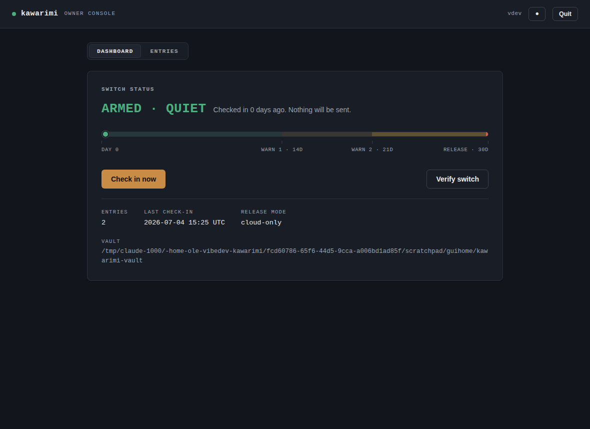

# kawarimi

**English** | [Español](README.es.md)

[](https://github.com/olemoudi/kawarimi/actions/workflows/ci.yml)
[](https://github.com/olemoudi/kawarimi/actions/workflows/ci.yml)
[](https://github.com/olemoudi/kawarimi/releases/latest)
[](LICENSE)

An encrypted **digital-legacy vault**. You keep instructions, credentials, and
documents encrypted while you are alive; if you die or become permanently
incapacitated, a dead man's switch delivers to a family member exactly what they
need to open the package — and nothing before then.

Two goals drive every design decision:

1. **No unauthorized disclosure while you are alive and capable.**
2. **Easy for the recipient** — a possibly non-technical family member must be
   able to open the package with a guided, plain-language wizard (Spanish and
   English).



## Download

Grab the file for your computer from the
[**latest release**](https://github.com/olemoudi/kawarimi/releases/latest):

| Your computer | File |
| --- | --- |
| Windows | `kawarimi-windows-amd64.exe` |
| Mac with Apple Silicon (2021 or later) | `kawarimi-darwin-arm64` |
| Mac with Intel | `kawarimi-darwin-amd64` |
| Linux | `kawarimi-linux-amd64` or `kawarimi-linux-arm64` |

The binaries are unsigned (there is no corporate certificate behind this
project), so the first launch needs one extra step:

- **Windows** — if SmartScreen warns, click **More info → Run anyway**.
- **macOS** — right-click the file and choose **Open**, then confirm. If macOS
  still refuses, open **System Settings → Privacy & Security**, scroll to the
  message about kawarimi, and click **Open Anyway**. (You may also need to run
  `chmod +x kawarimi-darwin-arm64` from Terminal the first time.)

Integrity: every release ships a `checksums.txt`; verify with
`sha256sum -c checksums.txt --ignore-missing`.

## Getting started (owner)

Run the program you downloaded. On a fresh machine it opens the **setup
wizard** in your browser (Spanish/English) and walks you through everything:

1. Create the vault and choose a password.
2. Save your three secrets (mnemonic, recovery code, recipient card) — shown once.
3. Configure the dead man's switch: email settings, who receives the vault, and
   the warning/release schedule.
4. Arm the cloud: paste a GitHub token and kawarimi creates the private switch
   repository and sets its secrets for you.
5. Build the recipient package (a zip with the encrypted vault and the programs
   for every platform) and upload it somewhere your recipients can reach.
6. Give each recipient the printed card. Then just check in from the dashboard
   (or `kawarimi checkin`) on your schedule.

Prefer a terminal? The same flow exists as CLI commands:

```sh
kawarimi init                   # create the vault (prints your secrets ONCE)
kawarimi add note "Bank accounts"
kawarimi switch setup           # dead man's switch: SMTP, recipients, schedule
kawarimi switch verify          # confirm it is armed and current
kawarimi checkin                # repeat on your schedule
kawarimi package build          # build the recipient package
```

## For the recipient

When the switch fires, the recipient gets an email with a **key**. They:

1. Download the package and unzip it.
2. Run the bundled `kawarimi` program — on Windows they can **double-click** it;
   on macOS/Linux they run `./kawarimi-<os> open`. (Bare `kawarimi` launches the
   same wizard automatically when it is sitting next to a package.)
3. Paste the **key** from the email and type the **words** from the card.
4. The decrypted files appear in a `decrypted/` folder; `INDEX.md` lists
   everything.

All recipient-facing text (package instructions, the release email, the wizard)
is bilingual: **Spanish first, then English**.

## Keeping kawarimi up to date

kawarimi updates itself. When a new version is released, the owner console shows an
**Update available** banner (and CLI commands print a one-line hint); one click, or
`kawarimi update`, downloads the new version, **verifies its Ed25519 signature and
checksum**, and replaces the binary. Restart and you're on the new version. Only the
owner tool self-updates — a recipient opening a vault package never does.

Two things migrate automatically or with a nudge:

- **Your vault.** If a new version needs a newer on-disk format, kawarimi upgrades
  your vault in place the next time you open it, keeping a timestamped backup under
  `~/.kawarimi/backups/`. Nothing to do.
- **Your cloud switch.** The dead man's switch automation is pushed to GitHub once,
  so a later improvement (or security fix) doesn't reach it automatically. After
  updating, run `kawarimi switch verify`; if it says the automation is outdated, run
  `kawarimi switch seed` to refresh it. If you changed vault contents, also re-run
  `kawarimi package build` and re-upload.

## How it works

The vault is encrypted with [age](https://github.com/FiloSottile/age) (X25519).
The master key is wrapped in several slots: your **password + device key**, a
**recovery code**, and an **8-word mnemonic** (your paper backup).

For the recipient, kawarimi uses a **key split** so that no single secret — and
no secret you have to hand out early — can open the vault before the switch
fires. Three things are required, held by three different parties/places:

| Secret | Who holds it | When the recipient gets it |
| --- | --- | --- |
| **Sealed payload** (`sealed_payload.age`) | shipped inside the package (public) | already in the download |
| **DMS key** (32 random bytes) | the dead man's switch | emailed when the switch fires |
| **Recipient passphrase** (6 words) | a physical card you give them | in hand, from you |

The sealed payload is the 8-word mnemonic encrypted under *both* the DMS key and
the recipient passphrase. A leaked package + card cannot open it (no DMS key); a
leaked DMS key cannot open it (no card). Both are needed, and the DMS key is only
released after you stop checking in.

There are **two delivery channels**:

- **Cloud (GitHub Actions)** — the real post-mortem trigger. A workflow in a
  dedicated repo reads a heartbeat you push on each check-in and emails the DMS
  key to your recipients once you are overdue. This runs whether or not your
  machine is on.
- **Local (systemd timer)** — sends you reminders while your machine runs. By
  default it holds no key ("cloud-only") and never performs the final release.

## Threat model (summary)

- **Attacker with the public package + the card, owner alive:** cannot open it —
  the DMS key has not been released.
- **Attacker who compromises the owner's machine:** in the default *cloud-only*
  mode the machine holds no DMS key, so this does not yield it. (Use full-disk
  encryption regardless.)
- **Attacker who intercepts the release email (DMS key) only:** cannot open the
  vault without the physical card.
- **False trigger reaching the intended recipients:** low severity — the key
  alone opens nothing. Rotate with `kawarimi switch rekey` only if the key
  reached someone beyond your recipients.

The full threat model — including the $100k/year cracking budget the password
strength meter is calibrated against — is in [THREAT_MODEL.md](THREAT_MODEL.md).

## Operational constraints

- The DMS repo must be a **separate, private, empty** GitHub repo (no README) so
  the pushed workflow lands on the default `main` branch and actually schedules.
- Keep `FinalDays` well under ~60 — GitHub auto-disables scheduled workflows
  after ~60 days of repo inactivity; `switch verify` warns if it is too high.
- The SSH key used for check-ins must be passphrase-less (the systemd timer runs
  unattended).

## Building from source

```sh
make build       # local binary, version stamped from git (CGO_ENABLED=0)
make test        # go test -short ./...
make cross       # recipient binaries for all platforms into dist/
```

Requires Go 1.25+. Dependencies are vendored, so builds work fully offline.

## More documentation

- [ARCHITECTURE.md](ARCHITECTURE.md) — full technical design (key split, header
  slots, switch engine, GUI, durability model).
- [docs/usage-flow.md](docs/usage-flow.md) — end-to-end lifecycle diagram.
- [docs/reliability-review.md](docs/reliability-review.md) — failure-mode review
  and the hardening applied.

## License

MIT — see [LICENSE](LICENSE).
