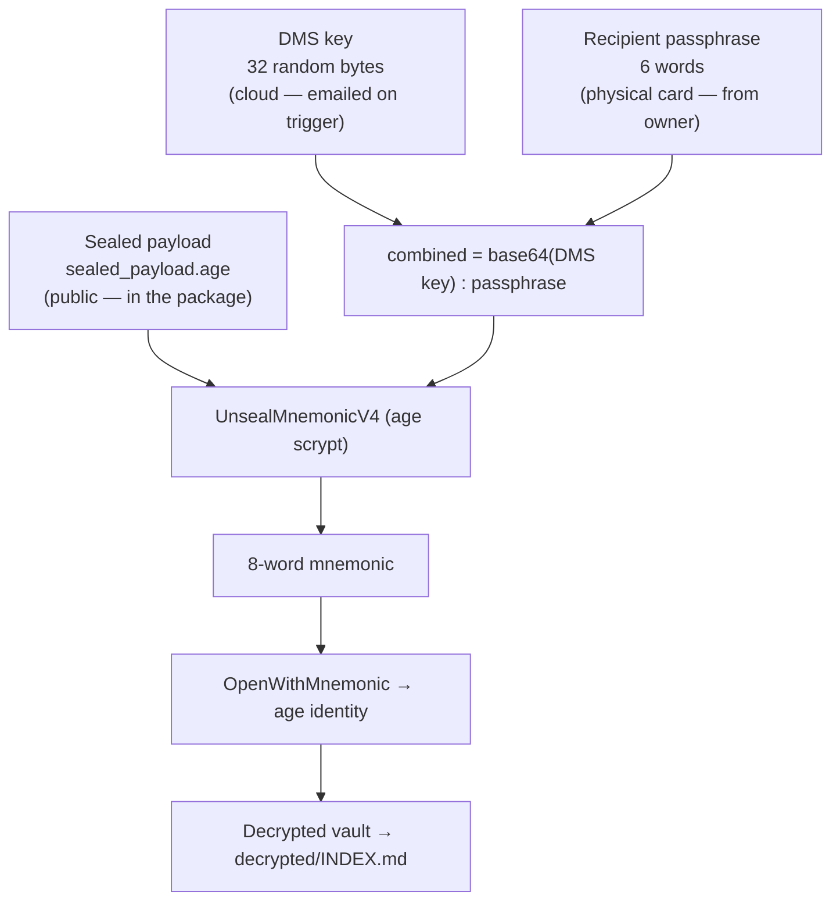

# kawarimi — usage flow

Canonical diagrams for how kawarimi is used end to end. The **lifecycle sequence
diagram** below is the primary one and is embedded (byte-identical) in
[ARCHITECTURE.md §15](../ARCHITECTURE.md#15-usage-flow) — keep the two copies in
sync. See [ARCHITECTURE.md](../ARCHITECTURE.md) for the full technical design.

The same setup lifecycle can be driven from the CLI (the commands below) or the
browser wizard (`kawarimi gui`, [ARCHITECTURE.md §11](../ARCHITECTURE.md#11-the-browser-gui-owner-console));
both call the same `internal/setup` orchestration, so the steps are identical.

Both diagrams use plain Mermaid and render directly on GitHub.

## Full lifecycle (owner → cloud → recipient)

Four phases: **setup/arming**, the **check-in loop**, the **overdue → release**
trigger, and the **recipient opening** the vault.

```mermaid
sequenceDiagram
    autonumber
    actor Owner
    participant CLI as kawarimi (CLI / wizard)
    participant DMS as Cloud DMS (GitHub Actions)
    participant SMTP as SMTP server
    actor Recipient

    Note over Owner,Recipient: Phase 1 — Setup & arming (once)
    Owner->>CLI: kawarimi init
    CLI->>CLI: Generate master key, age identity, 8-word mnemonic,<br/>recovery code, 6-word recipient passphrase
    CLI->>CLI: Seal V4 payload (mnemonic under DMS key + passphrase)<br/>→ sealed_payload.age
    CLI-->>Owner: Print mnemonic, recovery code, passphrase ONCE
    Owner->>CLI: kawarimi add note / credential / document
    Owner->>CLI: kawarimi switch setup / seed
    CLI->>DMS: Push deadman.yml + last_checkin (SSH)
    Owner->>DMS: Set Actions secrets (DMS_KEY, SMTP_*,<br/>RECIPIENT_EMAILS, VAULT_PACKAGE_LOCATION)
    Owner->>CLI: kawarimi package build
    CLI-->>Owner: package.zip (encrypted vault + binaries, no secrets)
    Owner->>Recipient: Hand over physical card (recipient passphrase)
    Owner->>Owner: Upload package.zip to VAULT_PACKAGE_LOCATION

    Note over Owner,Recipient: Phase 2 — Check-in loop (while alive)
    loop Every check-in interval
        Owner->>CLI: kawarimi checkin
        CLI->>CLI: Write local last_checkin
        CLI->>DMS: Push heartbeat over SSH
    end
    Note over DMS: Daily cron: quiet while current;<br/>Warning1 / Warning2 email the owner only

    Note over Owner,Recipient: Phase 3 — Overdue → final release
    DMS->>DMS: Daily cron reads last_checkin
    alt heartbeat missing / unparseable
        DMS->>SMTP: Alert OWNER "switch NOT armed"<br/>(fail-closed — no release)
    else days_since ≥ FinalDays
        DMS->>SMTP: Email DMS key + package location
        SMTP-->>Recipient: Release email (DMS key)
    end

    Note over Owner,Recipient: Phase 4 — Recipient opens the vault
    Recipient->>Recipient: Download & unzip package
    Recipient->>CLI: Run bundled binary (auto-wizard)
    Recipient->>CLI: Paste DMS key (email) + type words (card)
    CLI->>CLI: UnsealMnemonicV4 → mnemonic → OpenWithMnemonic
    CLI-->>Recipient: decrypted/ files + INDEX.md
```

## Supplementary — the V4 key-split

Why no single leaked secret opens the vault: three inputs, held by three
parties, are all required. Only the DMS key is released automatically, and only
after the switch fires. See [ARCHITECTURE.md §4](../ARCHITECTURE.md#4-the-v4-key-split-core-security-guarantee).


